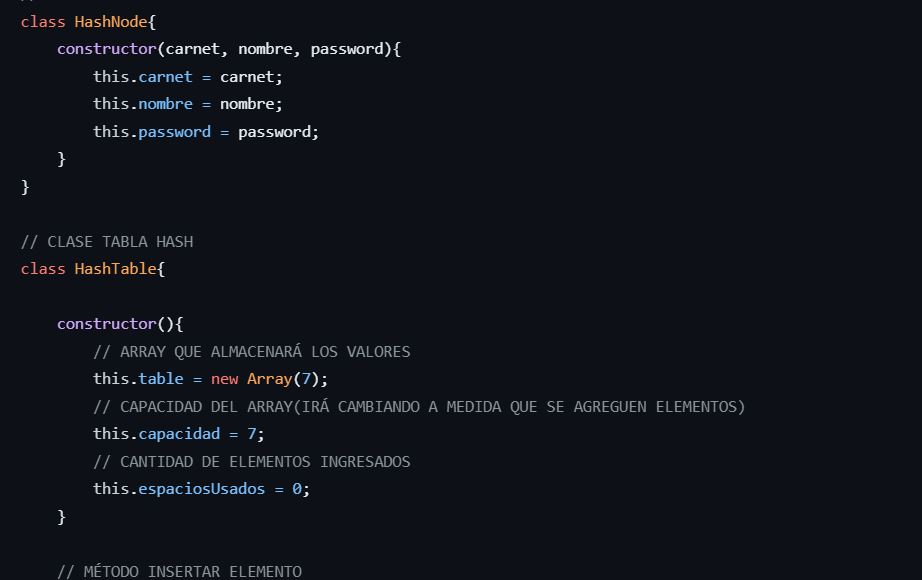
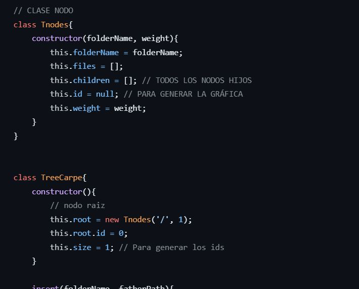
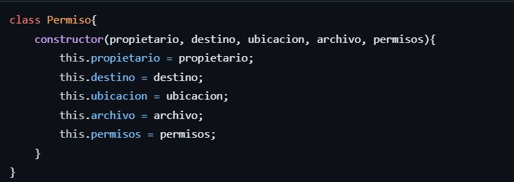
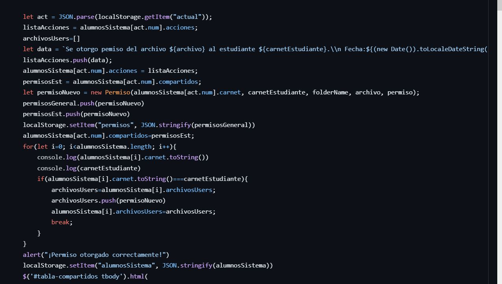
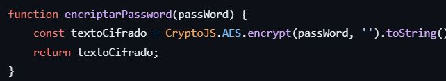

# Manual Tecnico
### Introducción:
En el proyecto en cuestión, se busca aplicar los conocimientos adquiridos en el curso de Estructuras de Datos para desarrollar diferentes estructuras de datos y algoritmos de manipulación de la información. El objetivo general es utilizar el lenguaje JavaScript para implementar estructuras de datos complejas y abordar temas de seguridad, además de utilizar HTML como interfaz gráfica. Para lograrlo, se trabajarán tres estructuras principales: Grafo Dirigido para el manejo de carpetas, Tabla Hash para el almacenamiento de usuarios y Blockchain para la seguridad y encriptación de mensajes y datos.

### Explicación del proyecto:
El objetivo específico principal es aplicar los conocimientos del curso de Estructuras de Datos en la implementación de diversas estructuras y algoritmos de manipulación de información. Para ello, se utilizará el lenguaje JavaScript y HTML como interfaz gráfica.

En primer lugar, se utilizará un Grafo Dirigido para el manejo de carpetas en el sistema. Esto implica que las carpetas estarán interconectadas y se podrán realizar acciones como crear, eliminar y modificar carpetas. Para acceder a las carpetas del sistema, se contará con una barra de búsqueda en la interfaz, donde los usuarios podrán ingresar la ruta de la carpeta deseada. Se realizará una validación para asegurarse de que la ruta ingresada corresponda a una carpeta existente. La estructura de datos utilizada para almacenar las carpetas será una matriz de adyacencia, que permitirá visualizar las relaciones entre directorios y facilitará la navegación entre carpetas.

En cuanto al almacenamiento de usuarios, se utilizará una Tabla Hash. Inicialmente, la tabla tendrá 7 espacios disponibles, pero cuando se alcance el 75% de utilización, la capacidad de la tabla se aumentará al siguiente número primo. Para insertar los usuarios en la tabla, se utilizará el carnet del usuario codificado como valor de referencia, el cual será utilizado como parámetro en una función hash por división para determinar el índice de inserción del nodo. En caso de colisiones, se empleará una resolución de direccionamiento abierto por salto al cuadrado, donde el valor hash calculado se elevará al cuadrado y se intentará insertar el nodo en la nueva posición. Si el nuevo hash supera los límites del arreglo, se recorrerá el arreglo desde el principio con los saltos restantes hasta encontrar una posición vacía.

Para garantizar la seguridad e integridad de los mensajes entre usuarios, se implementará el sistema de Blockchain. En este sistema, los mensajes se almacenarán en una estructura similar a una lista doblemente enlazada de nodos. Cada bloque del Blockchain tendrá los siguientes atributos: índice, marca de tiempo, emisor, receptor, mensaje, hash anterior y hash. El índice representa el número del bloque, comenzando con el bloque génesis (índice 0) y aumentando secuencialmente. La marca de tiempo registra la fecha y hora exactas de creación del bloque. El emisor y receptor del mensaje se identificarán utilizando el carnet correspondiente. El mensaje se encriptará utilizando el algoritmo AES. El hash anterior se utilizará para verificar la integridad de la cadena de bloques, y en el caso del bloque génesis, el hash anterior será "0000". 

### Implemetaciones en codigo y estructuras

