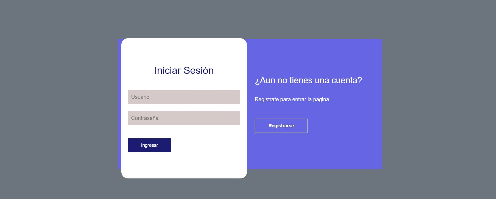
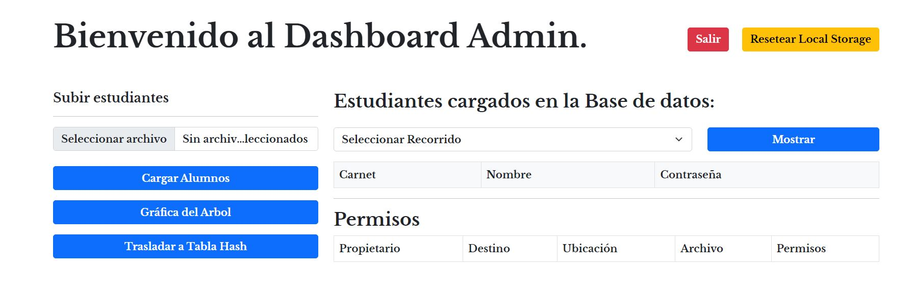
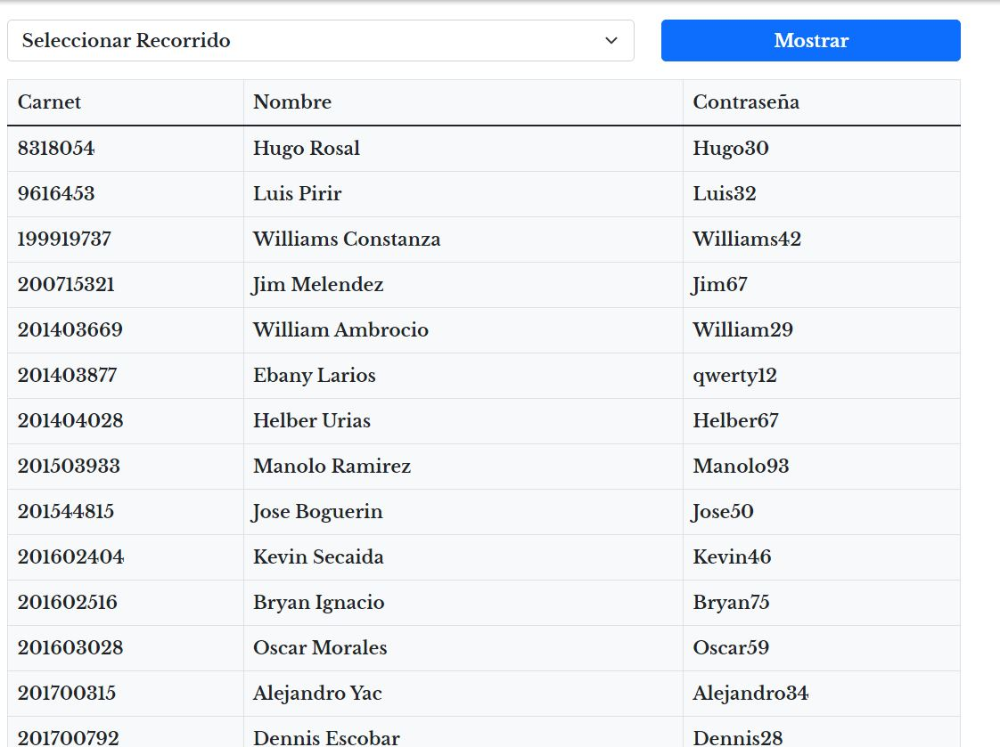
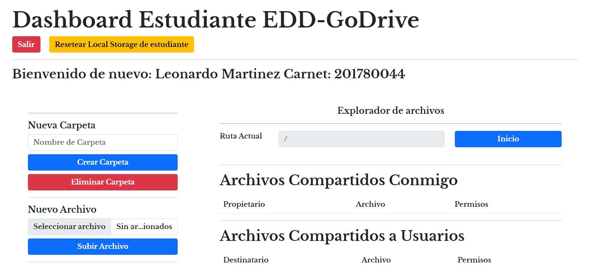
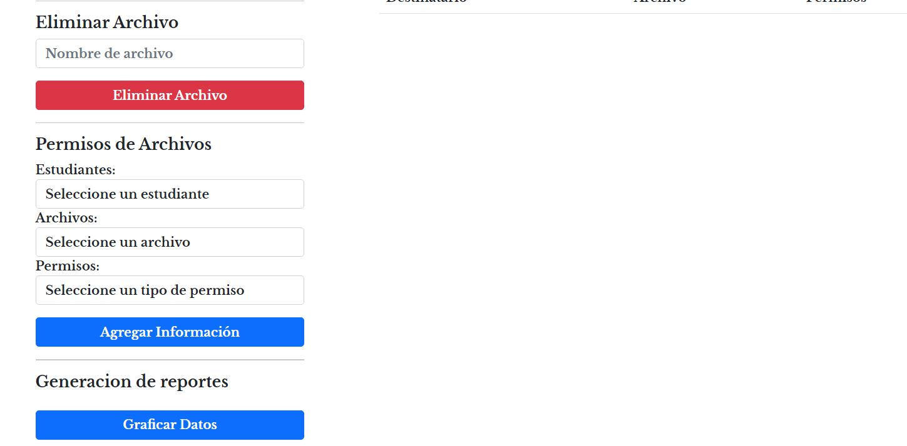

# Manual de Usuario
### Introducción y explicación de la web app:
Este manual de usuario tiene como objetivo guiar al usuario en el uso de una aplicación que permite aplicar los conocimientos del curso Estructuras de Datos en el desarrollo de diferentes estructuras de datos y algoritmos de manipulación de información en ellas. La aplicación utiliza JavaScript para implementar estructuras de datos complejas y temas de seguridad, y HTML como interfaz gráfica. Además, se utiliza la herramienta Graphviz para graficar las estructuras de datos y HTML para visualizar imágenes.

La aplicación cuenta con diferentes estructuras de datos como grafo dirigido para manejo de carpetas, tabla hash para almacenamiento de usuarios y blockchain para seguridad y encriptación de envío de mensajes y manejo de datos. Además, se define e implementa algoritmos de inserción, encriptación de datos y seguridad.

Para encriptar/desencriptar se permite el uso de cualquier librería o biblioteca de encriptación, como por ejemplo crypto de JavaScript u otra librería que el usuario desee. La página principal de la aplicación permite a los estudiantes aceptados iniciar sesión y a los administradores almacenar a los estudiantes en una tabla hash.

La vista principal muestra diferentes opciones de creación, eliminación y modificación de carpetas. La barra de búsqueda permite acceder a las carpetas del sistema. Además, se utiliza un árbol indexado para leer las carpetas del sistema y se almacenan en una matriz de adyacencia para poder realizar el árbol de recubrimiento, que servirá para visualizar las relaciones entre directorios y la navegación entre carpetas.

Para el manejo de la mensajería se utiliza el sistema de blockchain para la seguridad e integridad del mismo. El sistema de blockchain cuenta con diferentes atributos como el número del bloque, fecha y hora de creación, el emisor del mensaje, el receptor del mensaje, el cuerpo del mensaje y el bloque previo, que sirve para validar que la cadena del blockchain no esté corrupta.

En resumen, esta aplicación es una herramienta muy completa y útil para el manejo de estructuras de datos complejas y temas de seguridad en JavaScript. A continuación, se presentará una guía detallada de cómo utilizar esta aplicación.

### Vistas de la Pagina de Interfaz:

